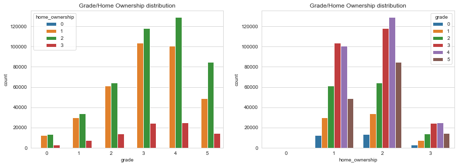
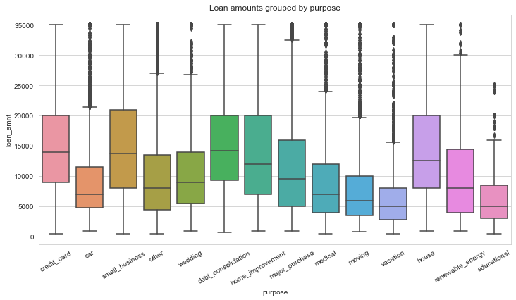
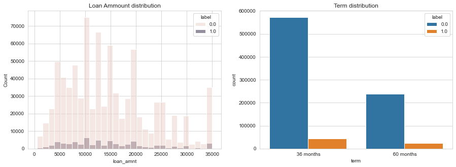
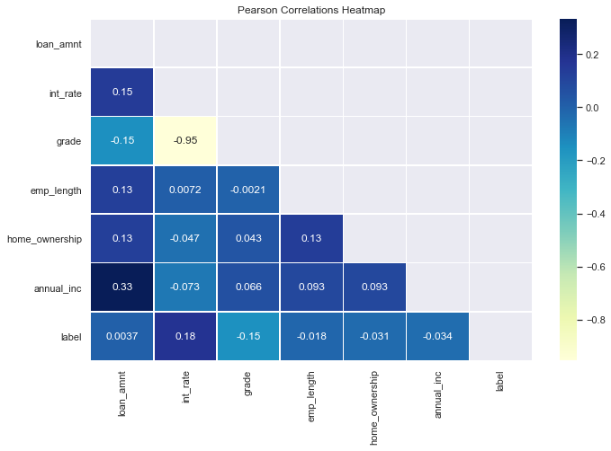

# **Credit Risk Analysis**
# **Project Overview**
Credit risk analysis plays a vital role in the finance industry, as financial institutions must evaluate the creditworthiness of individuals and businesses before approving loans or credit lines. Traditional methods often rely on manually reviewing credit reports, financial statements, and other documents, making the process time-consuming, costly, and prone to errors. By leveraging machine learning, institutions can automate credit risk analysis, enhancing both efficiency and accuracy.
# **Business Understanding**
Loan default prediction plays a vital role in the lending process, enabling lenders to evaluate the risk of borrowers failing to repay their loans. By examining factors such as income, credit history, Work Experience, and economic trends, this project aims to enable lenders decide on the best model to mitigate risks and reduce potential losses.
#### Data Understanding
Data Source: https://www.kaggle.com/datasets/ranadeep/credit-risk-dataset/data
This is a credit history of the customers from a financial institution. Agenda is to predict for possible credit defaulters upfront and help the financial institutions to take steps accordingly.

    1-The dataset has 887,379 rows and 73 columns.
    2-There are 50 numerical columns and 23 categorical columns.
    3-Approximately 20 columns have missing values greater than 70%.
    4-The average budgeted amount is nearly equal to the amount borrowed.
    5-The average loan interest rate is 13.24%, which is quite large.
    6-There are 5 columns in date format, which are 'issue_d', 'last_pymnt_d','next_pymnt_d' earliest_cr_line', and last_credit_pull_d'.
# Analysis and Observations

#### Observations and Interpretations
These visualizations help analyze how different categorical variables (like grade, home_ownership, purpose, and label) interact.

1. The number of Borrowers with high grade is small compared ti low grade

2. Most Money borrowes goal from labels 0 and 1 are debt consolidation
   
3. The highest number of grades who were able to complete the loan was grade 4, while the most failed to complete the loan was grade 3

#### Key Observations
There are 5 highest categories for the amount of credit with the following purposes: Credit card, MSME business, debt conolidation, home improvemnt and buying a house

#### Key Observation
The nominal value of the largets debt is 10000USD
The maximum maturity is 36months, while for 60 months it is almost a third
Most of the credits that can be paid in full are obtained from the verified verification status

#### Key Observation
The amount of credit is very dependent on the annual income of the borrower

# Using Decision Tree Classifier

The Decision Tree model provides a detailed classification report which helps in understanding the precision, recall, and F1-score for each class.

# Using Random Forest Classifier

The Random Forest model generally provides better accuracy and robustness compared to the Decision Tree model. It also helps in reducing overfitting

# Recommendations

Model Selection:
Based on the accuracy and classification report, the Random Forest model is recommended for predicting credit risk as it provides better accuracy and generalization.

Feature Importance:
Use the feature importance attribute of the Random Forest model to understand which features are most influential in predicting credit risk. This can help in feature selection and improving the model further.

Hyperparameter Tuning:
Perform hyperparameter tuning using techniques like Grid Search or Random Search to further improve the performance of the Random Forest model.

Cross-Validation:
Use cross-validation to ensure that the model's performance is consistent across different subsets of the data.

Ensemble Methods:
Consider using ensemble methods that combine multiple models to improve prediction accuracy and robustness.
